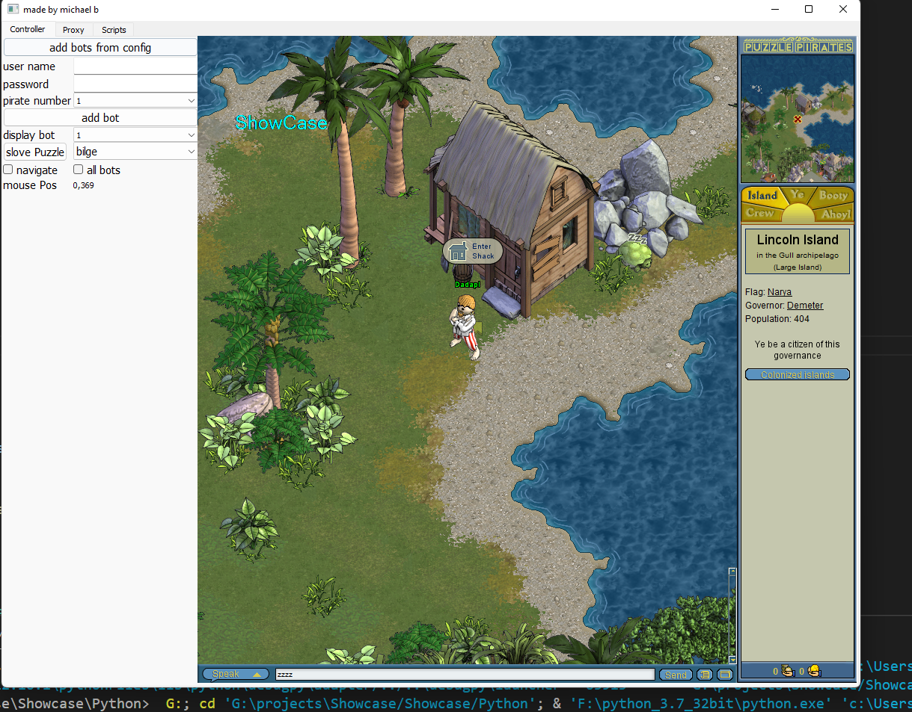

# show-case-WIP
## Description

# automate tool with a graphic interface that use windows internal function.
- [x] attach/launch a process.
- [x] virtual keyboard/mouse.
- [x] esay opening and managing multi processing (same process/application).
- [x] overlay (draw/interact/delate.inside the application as 3th party). 
  - [ ] use OpenGL as the backend.
- [ ] multi diffrent applications/processes.
- [ ] linux support.

## Screenshot Example
using the tool for a game called Puzzle Pirate.

